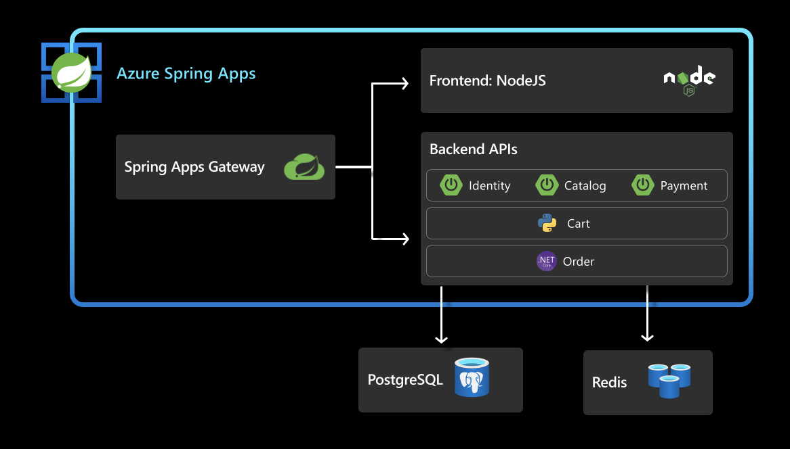

이 단원에서는 애플리케이션을 Persistent Store (Postgres, Redis용 Azure Cache)에 연결 합니다. 해당 자원들은 이미 주어진 자원 그룹에 생성 되어 있습니다. : 

이 단원을 완료하면 아키텍처는 아래와 같이 보일 것입니다:
 

## 1. Prepare your environment

`./scripts/setup-db-env-variables.sh`를 열고 다음의 정보를 입력합니다.:

```shell
export AZURE_CACHE_NAME=acme-fitness-cache-asaXX                 
export POSTGRES_SERVER=acme-fitness-db-asaXX                
```
위 변수의 값은 Azure Portal 에서 해당 리소스 그룹으로 이동하여 조회할 수 있습니다. 해당 리소스 그룹의 일부인 모든 리소스가 나열되고 데이터베이스 및 캐시 항목이 표시됩니다.

그런 다음 환경을 설정합니다:

```shell
source ./scripts/setup-db-env-variables.sh
```

### 1.1. Allow connections from other Azure Services

```shell
az postgres flexible-server firewall-rule create --rule-name allAzureIPs \
     --name ${POSTGRES_SERVER} \
     --resource-group ${RESOURCE_GROUP} \
     --start-ip-address 0.0.0.0 --end-ip-address 0.0.0.0
     
### Enable the uuid-ossp extension
az postgres flexible-server parameter set \
    --resource-group ${RESOURCE_GROUP} \
    --server-name ${POSTGRES_SERVER} \
    --name azure.extensions --value uuid-ossp
```

## 2. Create a database for the services:

Order 서비스용 데이터베이스 생성:

```shell
az postgres flexible-server db create \
  --database-name ${ORDER_SERVICE_DB} \
  --server-name ${POSTGRES_SERVER}
```

Catalog 서비스용 데이터베이스 생성:

```shell
az postgres flexible-server db create \
  --database-name ${CATALOG_SERVICE_DB} \
  --server-name ${POSTGRES_SERVER}
```

> Note: 계속 진행하기 전에 모든 서비스가 준비될 때까지 기다립니다.

## 3. Create Service Connectors

Order 서비스 및 Catalogs 서비스는 Postgres용 Azure 데이터베이스를 사용합니디. 해당 애플리케이션에 대한 Service Connector를 만듭니다:

```shell
# Bind order service to Postgres
az spring connection create postgres-flexible \
    --resource-group ${RESOURCE_GROUP} \
    --service ${SPRING_APPS_SERVICE} \
    --connection ${ORDER_SERVICE_DB_CONNECTION} \
    --app ${ORDER_SERVICE_APP} \
    --deployment default \
    --tg ${RESOURCE_GROUP} \
    --server ${POSTGRES_SERVER} \
    --database ${ORDER_SERVICE_DB} \
    --secret name=${POSTGRES_SERVER_USER} secret=${POSTGRES_SERVER_PASSWORD} \
    --client-type dotnet
    

# Bind catalog service to Postgres
az spring connection create postgres-flexible \
    --resource-group ${RESOURCE_GROUP} \
    --service ${SPRING_APPS_SERVICE} \
    --connection ${CATALOG_SERVICE_DB_CONNECTION} \
    --app ${CATALOG_SERVICE_APP} \
    --deployment default \
    --tg ${RESOURCE_GROUP} \
    --server ${POSTGRES_SERVER} \
    --database ${CATALOG_SERVICE_DB} \
    --secret name=${POSTGRES_SERVER_USER} secret=${POSTGRES_SERVER_PASSWORD} \
    --client-type springboot
```

카트 서비스를 사용하려면 Redis용 Azure Cache에 연결해야 합니다. 이를 위한 Service Connector를 만듭니다.:

```shell
az spring connection create redis \
    --resource-group ${RESOURCE_GROUP} \
    --service ${SPRING_APPS_SERVICE} \
    --connection $CART_SERVICE_CACHE_CONNECTION \
    --app ${CART_SERVICE_APP} \
    --deployment default \
    --tg ${RESOURCE_GROUP} \
    --server ${AZURE_CACHE_NAME} \
    --database 0 \
    --client-type java 
```

> Note: 현재 Azure Spring Apps CLI Extension 은 Java, Springboot 또는 .NET 의 클라이언트 유형만 허용합니다.
> Cart 서비스는 connection string 이 파이썬과 자바에서 동일하기 때문에 클라이언트 연결 유형 자바를 사용합니다.
> 이 옵션은 CLI에서 추가 옵션을 사용할 수 있게 되면 변경됩니다.

## 4. Update Applications

다음으로 해당 애플리케이션들을 업데이트하여 새로 생성된 데이터베이스와 redis 캐시를 사용하도록 합니다.

Service Connector를 사용하려면 Catalog 서비스를 다시 시작하세요:

```shell
az spring app restart --name ${CATALOG_SERVICE_APP}
```

PostgreSQL Connection String 을 검색하고 Order 서비스를 업데이트합니다:

```shell
POSTGRES_CONNECTION_STR=$(az spring connection show \
    --resource-group ${RESOURCE_GROUP} \
    --service ${SPRING_APPS_SERVICE} \
    --deployment default \
    --connection ${ORDER_SERVICE_DB_CONNECTION} \
    --app ${ORDER_SERVICE_APP} --query "configurations[0].value" -otsv)

az spring app update \
    --name order-service \
    --env "DatabaseProvider=Postgres" "ConnectionStrings__OrderContext=${POSTGRES_CONNECTION_STR}" "AcmeServiceSettings__AuthUrl=https://${GATEWAY_URL}"
```

Redis Connection String 을 검색하고 Cart 서비스를 업데이트합니다:

```shell
REDIS_CONN_STR=$(az spring connection show \
    --resource-group ${RESOURCE_GROUP} \
    --service ${SPRING_APPS_SERVICE} \
    --deployment default \
    --app ${CART_SERVICE_APP} \
    --connection ${CART_SERVICE_CACHE_CONNECTION} --query "configurations[0].value" -otsv)

az spring app update \
    --name cart-service \
    --env "CART_PORT=8080" "REDIS_CONNECTIONSTRING=${REDIS_CONN_STR}" "AUTH_URL=https://${GATEWAY_URL}"
```

⬅️ Previous guide: [05 - Hands On Lab 3.2 - Bind Apps to ACS and Service Registry](../05-hol-3.2-bind-apps-to-acs-service-reg/README.md)

➡️ Next guide: [07 - Hands On Lab 3.4 Configure Single Sign On](../07-hol-3.4-configure-single-signon/README.md)