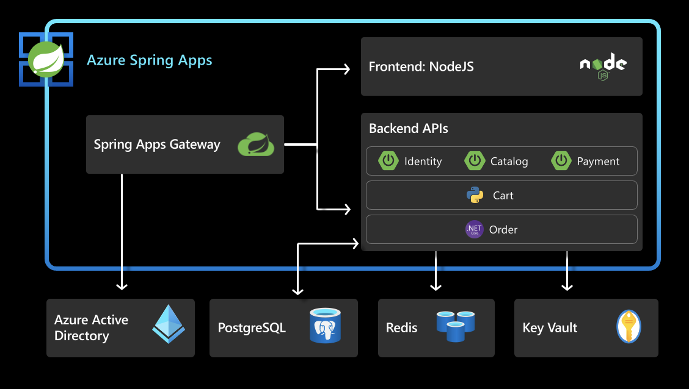

이 단원에서는 Azure 키 볼트를 사용하여 Azure 서비스에 연결하기 위한 암호를 안전하게 저장하고 로드합니다.

이 섹션이 완료되면 아키텍처는 다음과 같습니다:
 

## 1. Prepare your environment

Key Vault URI 를 저장합니다

```shell
export KEYVAULT_URI=$(az keyvault show --name ${KEY_VAULT} --query 'properties.vaultUri' -otsv)
```
## 2. Store database connection secrets in Key Vault.

```shell
export POSTGRES_SERVER_FULL_NAME="${POSTGRES_SERVER}.postgres.database.azure.com"

az keyvault secret set --vault-name ${KEY_VAULT} \
    --name "POSTGRES-SERVER-NAME" --value ${POSTGRES_SERVER_FULL_NAME}

az keyvault secret set --vault-name ${KEY_VAULT} \
    --name "ConnectionStrings--OrderContext" --value "Server=${POSTGRES_SERVER_FULL_NAME}; \
     Database=${ORDER_SERVICE_DB};Port=5432;Ssl Mode=Require;User Id=${POSTGRES_SERVER_USER};Password=${POSTGRES_SERVER_PASSWORD}"
    
az keyvault secret set --vault-name ${KEY_VAULT} \
    --name "CATALOG-DATABASE-NAME" --value ${CATALOG_SERVICE_DB}
    
az keyvault secret set --vault-name ${KEY_VAULT} \
    --name "POSTGRES-LOGIN-NAME" --value ${POSTGRES_SERVER_USER}
    
az keyvault secret set --vault-name ${KEY_VAULT} \
    --name "POSTGRES-LOGIN-PASSWORD" --value ${POSTGRES_SERVER_PASSWORD}
```

## 3. Retrieve and store redis connection secrets in Key Vault.

```shell
export REDIS_HOST=$(az redis show -n ${AZURE_CACHE_NAME} --query "hostName" -otsv)

export REDIS_PORT=$(az redis show -n ${AZURE_CACHE_NAME} --query "sslPort" -otsv)

export REDIS_PRIMARY_KEY=$(az redis list-keys -n ${AZURE_CACHE_NAME} --query "primaryKey" -otsv)

az keyvault secret set --vault-name ${KEY_VAULT} \
  --name "CART-REDIS-CONNECTION-STRING" --value "rediss://:${REDIS_PRIMARY_KEY}@${REDIS_HOST}:${REDIS_PORT}/0"  
```

## 4. Store SSO Secrets in Key Vault.

```shell
az keyvault secret set --vault-name ${KEY_VAULT} \
    --name "SSO-PROVIDER-JWK-URI" --value ${JWK_SET_URI}
```

> Note: 싱글 사인온을 구성하지 않은 경우 SSO-PROVIDER-JWK-URI 암호 생성을 건너뛸 수 있습니다.

## 5. Enable System Assigned Identities for applications and export identities to environment.

```shell
az spring app identity assign --name ${CART_SERVICE_APP}

export CART_SERVICE_APP_IDENTITY=$(az spring app show --name ${CART_SERVICE_APP} --query 'identity.principalId' -otsv)

az spring app identity assign --name ${ORDER_SERVICE_APP}

export ORDER_SERVICE_APP_IDENTITY=$(az spring app show --name ${ORDER_SERVICE_APP} --query 'identity.principalId' -otsv)

az spring app identity assign --name ${CATALOG_SERVICE_APP}

export CATALOG_SERVICE_APP_IDENTITY=$(az spring app show --name ${CATALOG_SERVICE_APP} --query 'identity.principalId' -otsv)

az spring app identity assign --name ${IDENTITY_SERVICE_APP}

export IDENTITY_SERVICE_APP_IDENTITY=$(az spring app show --name ${IDENTITY_SERVICE_APP} --query 'identity.principalId' -otsv)
```

## 6. Add an access policy to Azure Key Vault to allow Managed Identities to read secrets.

```shell
az keyvault set-policy --name ${KEY_VAULT} \
    --object-id ${CART_SERVICE_APP_IDENTITY} --secret-permissions get list
    
az keyvault set-policy --name ${KEY_VAULT} \
    --object-id ${ORDER_SERVICE_APP_IDENTITY} --secret-permissions get list

az keyvault set-policy --name ${KEY_VAULT} \
    --object-id ${CATALOG_SERVICE_APP_IDENTITY} --secret-permissions get list

az keyvault set-policy --name ${KEY_VAULT} \
    --object-id ${IDENTITY_SERVICE_APP_IDENTITY} --secret-permissions get list
```

## 7. Activate applications to load secrets from Azure Key Vault

Service Connector 를 삭제하고 환경 변수를 사용하여 Azure Key Vault에서 암호를 읽어 오도록 어플리케이션을 변경 합니다.

```shell
az spring connection delete \
    --resource-group ${RESOURCE_GROUP} \
    --service ${SPRING_APPS_SERVICE} \
    --connection ${ORDER_SERVICE_DB_CONNECTION} \
    --app ${ORDER_SERVICE_APP} \
    --deployment default \
    --yes 

az spring connection delete \
    --resource-group ${RESOURCE_GROUP} \
    --service ${SPRING_APPS_SERVICE} \
    --connection ${CATALOG_SERVICE_DB_CONNECTION} \
    --app ${CATALOG_SERVICE_APP} \
    --deployment default \
    --yes 

az spring connection delete \
    --resource-group ${RESOURCE_GROUP} \
    --service ${SPRING_APPS_SERVICE} \
    --connection ${CART_SERVICE_CACHE_CONNECTION} \
    --app ${CART_SERVICE_APP} \
    --deployment default \
    --yes 
    
az spring app update --name ${ORDER_SERVICE_APP} \
    --env "ConnectionStrings__KeyVaultUri=${KEYVAULT_URI}" "AcmeServiceSettings__AuthUrl=https://${GATEWAY_URL}" "DatabaseProvider=Postgres"

az spring app update --name ${CATALOG_SERVICE_APP} \
    --config-file-pattern catalog/default,catalog/key-vault \
    --env "SPRING_CLOUD_AZURE_KEYVAULT_SECRET_PROPERTY_SOURCES_0_ENDPOINT=${KEYVAULT_URI}" "SPRING_CLOUD_AZURE_KEYVAULT_SECRET_PROPERTY_SOURCES_0_NAME='acme-fitness-store-vault'"  "SPRING_PROFILES_ACTIVE=default,key-vault"
    
az spring app update --name ${IDENTITY_SERVICE_APP} \
    --config-file-pattern identity/default,identity/key-vault \
    --env "SPRING_CLOUD_AZURE_KEYVAULT_SECRET_PROPERTY_SOURCES_0_ENDPOINT=${KEYVAULT_URI}" "SPRING_CLOUD_AZURE_KEYVAULT_SECRET_PROPERTY_SOURCES_0_NAME='acme-fitness-store-vault'" "SPRING_PROFILES_ACTIVE=default,key-vault"
    
az spring app update --name ${CART_SERVICE_APP} \
    --env "CART_PORT=8080" "KEYVAULT_URI=${KEYVAULT_URI}" "AUTH_URL=https://${GATEWAY_URL}"
```

## 8. Test the application
앱을 열고 카트에 품목을 추가한 후 주문을 제출하여 모든 것이 예상대로 작동하는지 확인합니다.

⬅️ Previous guide: [07 - Hands On Lab 3.4 - Configure Single Sign On](../07-hol-3.4-configure-single-signon/README.md)

➡️ Next guide: [09 - Hands On Lab 4.1 - End-End Observability](../09-hol-4.1-end-to-end-observability/README.md)